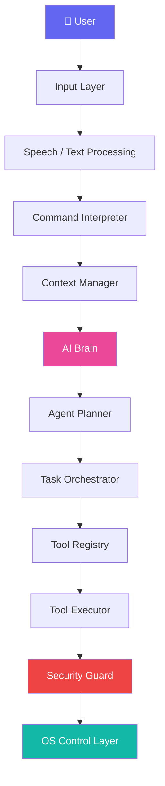

# 🤖 JARVIS AI — Complete Analysis & Phased Implementation Plan

> **Project:** Personal AI Operating Layer (Iron Man–style JARVIS)
> **Language:** Python | **Platforms:** Kali Linux / Windows
> **Architecture:** Modular + Multi-Agent + Event-Driven
> **Document Version:** 2.0 | **Date:** 2026-03-10

---

## 📊 CURRENT STATUS — What's Implemented

### ✅ Complete Components (Phase 1-3)

| Component | File | Status | Description |
|-----------|------|--------|-------------|
| AI Brain | `ai/brain.py` | ✅ | Ollama + OpenAI backends |
| Model Router | `ai/model_router.py` | ✅ | Task-based LLM selection |
| Command Interpreter | `core/command_interpreter.py` | ✅ | Intent detection |
| Context Manager | `core/context_manager.py` | ✅ | Conversation tracking |
| State Manager | `core/state_manager.py` | ✅ | System state |
| Event Engine | `core/event_engine.py` | ✅ | Basic events |
| Tool Registry | `tools/tool_registry.py` | ✅ | Decorator tools |
| Tool Executor | `tools/tool_executor.py` | ✅ | Execution engine |
| System Control | `tools/system_control.py` | ✅ | 15+ OS tools |
| File Manager | `tools/file_manager.py` | ✅ | File operations |
| Automation | `modules/automation/__init__.py` | ✅ | Keyboard/mouse |
| Text Input | `modules/speech/text_input.py` | ✅ | REPL input |
| Security | `security/permission_engine.py` | ✅ | 3 permission levels |
| Config | `config/settings.yaml` | ✅ | YAML config |

### 🔶 Pending Components (Phase 4-10)

| Component | Phase | Priority | Description |
|-----------|-------|----------|-------------|
| Agent Planner | 4 | HIGH | Multi-step task decomposition |
| Multi-Agent System | 4 | HIGH | Specialized agents |
| Voice Input | 5 | HIGH | Wake word + STT |
| Voice Output | 5 | HIGH | TTS responses |
| Memory System | 6 | MEDIUM | SQLite + FAISS |
| Knowledge Base | 6 | MEDIUM | Document search |
| Habit Learning | 6 | MEDIUM | Pattern detection |
| Web Automation | 7 | MEDIUM | Playwright |
| Screen Understanding | 7 | MEDIUM | OCR |
| API Server | 8 | LOW | FastAPI |
| Plugin System | 8 | LOW | Extensions |
| GUI Dashboard | 9 | LOW | Web UI |

---

## 📊 Part 1: Full Analysis of MASTER_PROMPT.md

### 1.1 Project Vision Summary

JARVIS is envisioned as a **personal AI operating system layer** that sits *above* the OS and provides:

| Capability | Description |
|---|---|
| 🗣️ Natural Language Understanding | Voice & text commands interpreted into structured actions |
| 🖥️ Computer Control | Full OS-level control (apps, files, processes, settings) |
| 🔄 Workflow Automation | Multi-step task execution without human intervention |
| 🧠 Reasoning & Planning | AI-driven decision-making using the Observe→Think→Plan→Act→Evaluate loop |
| 📚 Continuous Learning | Habit detection, pattern recognition, and proactive suggestions |
| 🌐 Web & Software Interaction | Browser automation, web scraping, API integrations |

### 1.2 Architecture Deep Dive

The architecture follows a **layered pipeline** design:



### 1.3 Component Inventory (29 Components Identified)

| # | Component | Category | Complexity | Dependencies |
|---|---|---|---|---|
| 4.1 | Input Layer | Input | 🟡 Medium | Whisper, Vosk, Porcupine |
| 4.2 | Streaming Voice Pipeline | Input | 🔴 High | Audio capture, Wake word, STT |
| 4.3 | Command Interpreter | NLU | 🔴 High | LangChain, Transformers, OpenAI/Ollama |
| 4.4 | Context Manager | Core | 🟡 Medium | SQLite/Redis |
| 4.5 | AI Brain | Core AI | 🔴 High | GPT, Llama, Mistral, Ollama |
| 4.6 | Model Router | Core AI | 🟡 Medium | Multiple LLM backends |
| 4.7 | Agent Planner | AI Agents | 🔴 High | AI Brain, Tool Registry |
| 4.8 | Multi-Agent System | AI Agents | 🔴 High | All agents + orchestrator |
| 4.9 | Task Orchestrator | Core | 🔴 High | Scheduler, retry logic |
| 4.10 | Tool Registry | Tools | 🟢 Low | None |
| 4.11 | Tool Executor | Tools | 🟡 Medium | Tool Registry |
| 4.12 | OS Control Layer | System | 🟡 Medium | subprocess, psutil |
| 4.13 | Automation Engine | System | 🟡 Medium | pyautogui, keyboard |
| 4.14 | File System Manager | System | 🟢 Low | os, shutil, pathlib |
| 4.15 | Web Automation | Automation | 🟡 Medium | Playwright, Selenium |
| 4.16 | Screen Understanding | Vision | 🔴 High | OpenCV, Tesseract |
| 4.17 | Vision System | Vision | 🔴 High | YOLO, CLIP |
| 4.18 | Memory System | Data | 🟡 Medium | SQLite, Redis, FAISS |
| 4.19 | Knowledge Base | Data | 🟡 Medium | Vector DB, Semantic Search |
| 4.20 | Event Engine | Core | 🟡 Medium | Event loop, listeners |
| 4.21 | Habit Learning Engine | AI | 🔴 High | Pattern detection, ML |
| 4.22 | Background Worker | Core | 🟡 Medium | Threading, async |
| 4.23 | Security & Permission | Security | 🟡 Medium | Rule engine |
| 4.24 | Resource Manager | System | 🟡 Medium | psutil |
| 4.25 | Observability System | DevOps | 🟢 Low | Logging |
| 4.26 | API Server | Interface | 🟡 Medium | FastAPI |
| 4.27 | Plugin System | Extension | 🟡 Medium | Dynamic loading |
| 4.28 | GUI Dashboard | UI | 🔴 High | PyQt/Tauri |
| 4.29 | Mobile Control | UI | 🔴 High | API + Mobile app |

### 1.4 Technology Stack Analysis

| Layer | Technologies | Notes |
|---|---|---|
| **Speech** | Whisper, Vosk, Porcupine | Whisper for accuracy, Vosk for offline, Porcupine for wake word |
| **AI/LLM** | OpenAI GPT, Llama, Mistral, Ollama | Model Router selects best model per task |
| **NLU** | LangChain, Transformers | Intent parsing + entity extraction |
| **Data** | SQLite, Redis, FAISS | Short-term (Redis), Long-term (SQLite), Semantic (FAISS) |
| **Vision** | OpenCV, Tesseract, YOLO, CLIP | Screen OCR + camera-based detection |
| **Automation** | pyautogui, keyboard, Playwright, Selenium | Desktop + web automation |
| **System** | subprocess, psutil, os, shutil | OS-level control |
| **API** | FastAPI | External HTTP interface |
| **UI** | PyQt, Tauri | Desktop dashboard |

### 1.5 Critical Risk Assessment

> [!WARNING]
> **High-Risk Areas to Address Early**

| Risk | Impact | Mitigation |
|---|---|---|
| LLM Hallucinations | Executing wrong/dangerous commands | Security Guard + confirmation prompts |
| Cross-platform compatibility | Different OS behaviors | Abstract OS layer with platform adapters |
| Resource consumption | LLMs are memory-heavy | Resource Manager + model offloading |
| Voice recognition accuracy | Misinterpreted commands | Multi-modal confirmation (voice + screen) |
| Security vulnerabilities | Autonomous system control is dangerous | Permission levels + command whitelisting |

---

## 🏗️ Part 2: Phased Implementation Plan

---

## Phase 1: Foundation & Core Infrastructure
**⏱️ Duration: 2–3 weeks | 🎯 Goal: Bootable skeleton with text input**

> [!IMPORTANT]
> This phase establishes the project structure, configuration system, logging, and the basic text-based command loop. **Nothing works without this foundation.**

### 1.1 Project Scaffolding

**Task:** Create the complete folder structure as defined in MASTER_PROMPT §6.

```
jarvis-ai/
├── main.py                    # Entry point
├── config/
│   ├── settings.yaml          # All configuration
│   └── __init__.py
├── core/
│   ├── __init__.py
│   ├── assistant.py           # Main JARVIS controller
│   ├── context_manager.py     # Session context
│   └── state_manager.py       # Global state
├── ai/
│   ├── __init__.py
│   ├── brain.py               # AI reasoning engine
│   ├── planner.py             # Task decomposition
│   └── model_router.py        # LLM selection
├── agents/
│   └── __init__.py
├── tools/
│   ├── __init__.py
│   ├── tool_registry.py       # Tool catalog
│   └── tool_executor.py       # Tool runner
├── modules/
│   ├── speech/
│   ├── vision/
│   └── automation/
├── memory/
│   ├── __init__.py
│   └── vector_memory.py
├── security/
│   ├── __init__.py
│   └── permission_engine.py
├── background/
│   ├── __init__.py
│   ├── worker.py
│   └── scheduler.py
├── api/
│   ├── __init__.py
│   └── api_server.py
├── ui/
│   └── dashboard.py
├── plugins/
├── logs/
├── tests/
├── requirements.txt
└── pyproject.toml
```

### 1.2 Configuration System

**Files to create:**
- `config/settings.yaml` — Central configuration (API keys, model preferences, paths, security levels)
- `config/__init__.py` — Settings loader using `pydantic` for validation

**Key config sections:**
```yaml
jarvis:
  name: "JARVIS"
  version: "1.0.0"
  platform: "auto"  # auto-detect Kali/Windows

ai:
  default_model: "ollama/llama3"
  openai_api_key: "${OPENAI_API_KEY}"
  temperature: 0.7

security:
  confirmation_required: true
  blocked_commands: ["rm -rf /", "format", "del /s"]

logging:
  level: "INFO"
  file: "logs/jarvis.log"
```

### 1.3 Observability System (§4.25)

**Files:** `logs/`, logging configuration in `core/assistant.py`

- Structured logging with `loguru` or Python's `logging`
- Rotating file handler → `logs/jarvis.log`
- Log levels: DEBUG, INFO, WARNING, ERROR, CRITICAL
- Command history persistence

### 1.4 Main Entry Point

**File:** `main.py`

```python
# Pseudo-code
async def main():
    config = load_config()
    logger = setup_logging(config)
    assistant = Assistant(config)
    
    logger.info("JARVIS initialized. Awaiting commands...")
    
    while True:
        user_input = await get_input()  # Text for now
        response = await assistant.process(user_input)
        display_response(response)
```

### 1.5 Basic Text Input (§4.1 — partial)

**File:** `modules/speech/text_input.py`

- Simple REPL loop (Read-Eval-Print Loop)
- Input sanitization
- Command history (using `readline`)

### 1.6 Security & Permission Engine — Skeleton (§4.23)

**File:** `security/permission_engine.py`

- Three levels: `safe`, `confirm`, `blocked`
- Command whitelist/blacklist from config
- Confirmation prompt for dangerous operations

### Deliverables for Phase 1:
- [x] Complete folder structure
- [x] Configuration system with YAML + env vars
- [x] Logging with rotation
- [x] Text-based REPL loop
- [x] Security skeleton (permission engine)
- [x] `main.py` entry point that boots JARVIS
- [x] Unit tests for config and security

---

## Phase 2: AI Brain & Command Interpretation
**⏱️ Duration: 2–3 weeks | 🎯 Goal: JARVIS understands natural language commands**

> [!IMPORTANT]
> This phase gives JARVIS its "brain" — the ability to *understand* what the user wants and *structure* it into actionable intents.

### 2.1 AI Brain (§4.5)

**File:** `ai/brain.py` ✅ **IMPLEMENTED**

**Implementation:**
- Abstract `BaseLLM` class with methods: `think()`, `plan()`, `summarize()`
- Concrete implementations:
  - `OllamaLLM` — local models (Llama3, Mistral) via Ollama API
  - `OpenAILLM` — GPT-4 via OpenAI API
- System prompt engineering for JARVIS persona
- Structured output parsing (JSON mode)

```python
class AIBrain:
    async def understand(self, text: str, context: dict) -> Intent:
        """Parse natural language into structured intent"""
    
    async def reason(self, intent: Intent, available_tools: list) -> Plan:
        """Create execution plan from intent"""
    
    async def summarize(self, results: list) -> str:
        """Summarize task results for user"""
```

### 2.2 Model Router (§4.6)

**File:** `ai/model_router.py`

**Logic:**
| Task Type | Default Model | Reason |
|---|---|---|
| Simple commands | Local LLM (Ollama) | Fast, private, no API cost |
| Research/Analysis | GPT-4 | Better reasoning |
| Code generation | Local coder model | Privacy for code |
| Summarization | Local LLM | Cost efficiency |

**Implementation:**
- Task classification based on intent category
- Fallback chain: local → cloud
- Response time tracking for optimization

### 2.3 Command Interpreter (§4.3)

**File:** `core/command_interpreter.py`

**Implementation:**
- LangChain-based intent extraction
- Entity recognition (app names, file paths, URLs, etc.)
- Structured output format:

```json
{
  "intent": "open_workspace",
  "entities": {
    "workspace_type": "pentesting",
    "apps": ["burpsuite", "firefox", "terminal"]
  },
  "confidence": 0.95,
  "requires_confirmation": false
}
```

- Predefined intent categories:
  - `system_control` — open/close apps, manage processes
  - `file_management` — create/move/organize files
  - `web_action` — search, browse, scrape
  - `automation` — run workflows
  - `information` — answer questions, research
  - `settings` — change JARVIS config

### 2.4 Context Manager (§4.4)

**File:** `core/context_manager.py`

**Stores:**
- Conversation history (last N exchanges)
- Current task state
- Active window/application info
- Running agents list
- User preferences learned so far

**Implementation:**
- In-memory context with Redis backing (optional)
- Context window management (trim old entries)
- Context serialization for LLM prompts

### Deliverables for Phase 2:
- [x] AI Brain with Ollama + OpenAI backends
- [x] Model Router with task-based selection
- [x] Command Interpreter with intent/entity extraction
- [x] Context Manager with conversation tracking
- [x] Integration tests: text input → intent → structured output
- [x] Prompt templates for JARVIS persona

---

## Phase 3: Tool System & OS Control
**⏱️ Duration: 2–3 weeks | 🎯 Goal: JARVIS can execute real actions on the computer**

> [!IMPORTANT]
> This is where JARVIS gains its "hands" — the ability to actually *do* things on the OS.

### 3.1 Tool Registry (§4.10)

**File:** `tools/tool_registry.py` ✅ **IMPLEMENTED**

**Design:**
- Decorator-based tool registration:

```python
@tool(
    name="open_app",
    description="Opens an application by name",
    parameters={"app_name": "str"},
    risk_level="safe"
)
async def open_app(app_name: str) -> ToolResult:
    ...
```

- Auto-discovery of tools from `tools/` directory
- Tool metadata for LLM function calling
- Tool categories: `system`, `file`, `web`, `automation`, `info`

### 3.2 Tool Executor (§4.11)

**File:** `tools/tool_executor.py`

**Features:**
- Async execution with timeout
- Error handling and retry logic
- Result formatting for user display
- Execution logging
- Security check before execution (calls Permission Engine)

```python
class ToolExecutor:
    async def execute(self, tool_name: str, params: dict) -> ToolResult:
        # 1. Security check
        # 2. Resource check
        # 3. Execute tool
        # 4. Log result
        # 5. Return formatted result
```

### 3.3 OS Control Layer (§4.12)

**File:** `tools/system_control.py`

**Cross-Platform Tools:**
| Tool | Linux Implementation | Windows Implementation |
|---|---|---|
| `open_app` | `subprocess.Popen` | `os.startfile` / `subprocess` |
| `close_app` | `pkill` / `psutil` | `taskkill` / `psutil` |
| `list_processes` | `psutil.process_iter` | `psutil.process_iter` |
| `system_info` | `/proc/`, `psutil` | `psutil`, `wmi` |
| `change_volume` | `amixer` / `pactl` | `pycaw` |
| `change_brightness` | `xrandr` | `wmi` |

### 3.4 File System Manager (§4.14)

**File:** `tools/file_manager.py`

**Tools:**
- `create_file(path, content)`
- `move_file(source, destination)`
- `rename_file(path, new_name)`
- `delete_file(path)` — requires confirmation
- `organize_folder(path, rules)` — categorize files by extension/type
- `search_files(pattern, directory)`
- `get_file_info(path)`

### 3.5 Automation Engine (§4.13)

**File:** `modules/automation/desktop_automation.py`

**Capabilities:**
- Keyboard simulation: `type_text()`, `press_key()`, `hotkey()`
- Mouse control: `click()`, `move_to()`, `scroll()`
- using `pyautogui` with failsafe enabled

### 3.6 Security Integration

- Every tool execution goes through `permission_engine.check()`
- Dangerous tools (file deletion, system changes) require confirmation
- All executions logged with timestamp, user, tool, params, result

### Deliverables for Phase 3:
- [x] Tool Registry with decorator-based registration
- [x] Tool Executor with security + error handling
- [x] 10+ OS control tools (open/close apps, process management)
- [x] File management tools (create, move, organize, search)
- [x] Desktop automation (keyboard, mouse)
- [x] Cross-platform support (Linux + Windows)
- [x] End-to-end test: "Jarvis open Firefox" → Firefox opens

---

## Phase 4: Agent System & Task Planning
**⏱️ Duration: 2–3 weeks | 🎯 Goal: JARVIS can break down and execute complex multi-step tasks**

> [!IMPORTANT]
> This phase transforms JARVIS from a simple command executor into an **autonomous agent** that plans and executes multi-step workflows.

### 4.1 Agent Planner (§4.7)

**File:** `ai/planner.py` ⚠️ **PENDING**

**Implementation:**
- ReAct-style planning (Reasoning + Acting)
- Plan decomposition using LLM:

```
User: "Prepare my pentesting environment"

Plan:
├── Step 1: Open BurpSuite       [tool: open_app]
├── Step 2: Open Firefox          [tool: open_app]
├── Step 3: Open Terminal         [tool: open_app]
├── Step 4: Open Notes            [tool: open_app]
└── Step 5: Arrange windows       [tool: arrange_windows]
```

- Plan validation before execution
- Step dependency resolution
- Parallel execution of independent steps

### 4.2 Agent Executor

**File:** `ai/agent_executor.py`

**The Autonomous Loop (§5):**
```
OBSERVE  → Read current state (screen, files, processes)
THINK    → Analyze situation using AI Brain
PLAN     → Create/update execution plan
ACT      → Execute next step using tools
EVALUATE → Check results, decide next action
```

**Features:**
- Max iteration limit (prevent infinite loops)
- User interruption support
- Progress reporting
- Error recovery and re-planning

### 4.3 Multi-Agent System (§4.8)

**Directory:** `agents/`

| Agent | File | Responsibility |
|---|---|---|
| Research Agent | `research_agent.py` | Web search, article analysis, report generation |
| Automation Agent | `automation_agent.py` | Workflow execution, repeating tasks |
| System Agent | `system_agent.py` | OS management, process control |
| File Agent | `file_agent.py` | File organization, search, management |
| Coding Agent | `coding_agent.py` | Code generation, debugging, analysis |

**Agent Interface:**
```python
class BaseAgent:
    name: str
    description: str
    available_tools: list[str]
    
    async def execute(self, task: str, context: dict) -> AgentResult:
        """Execute agent task using the autonomous loop"""
```

### 4.4 Task Orchestrator (§4.9)

**File:** `core/task_orchestrator.py`

**Features:**
- Task queue management (priority-based)
- Parallel task execution
- Task scheduling (cron-like):
  ```yaml
  morning_routine:
    schedule: "0 9 * * *"
    steps:
      - open_email
      - open_calendar
      - open_workspace
  ```
- Background task monitoring
- Task state persistence (resume after restart)

### Deliverables for Phase 4:
- [ ] Agent Planner with LLM-based plan decomposition
- [ ] Agent Executor with Observe→Think→Plan→Act→Evaluate loop
- [ ] 5 specialized agents (Research, Automation, System, File, Coding)
- [ ] Task Orchestrator with scheduling and queue management
- [ ] End-to-end test: "Jarvis prepare pentesting environment" → 4 apps open
- [ ] Workflow templates (morning routine, workspace setup)

---

## Phase 5: Voice Interface & Speech Pipeline
**⏱️ Duration: 2–3 weeks | 🎯 Goal: Hands-free voice interaction with JARVIS**

> [!IMPORTANT]
> This phase makes JARVIS truly feel like Iron Man's AI — voice-activated with natural speech output.

### 5.1 Wake Word Detection (§4.1, §4.2)

**File:** `modules/speech/wake_word_detector.py`

**Implementation:**
- **Porcupine** for custom wake word ("Hey Jarvis" / "Jarvis")
- Always-on, low-resource listening
- Configurable sensitivity

### 5.2 Speech-to-Text (§4.1, §4.2)

**File:** `modules/speech/voice_listener.py`

**Implementation:**
- **Whisper** (OpenAI) for high-accuracy transcription
- **Vosk** as offline fallback
- Streaming audio capture using `sounddevice` or `pyaudio`
- Voice Activity Detection (VAD) for smart start/stop

### 5.3 Streaming Voice Pipeline (§4.2)

**File:** `modules/speech/audio_stream.py`

**Pipeline:**
```
🎤 Microphone
    → Audio Capture (sounddevice)
    → Wake Word Detection (Porcupine)
    → Voice Activity Detection
    → Speech-to-Text (Whisper/Vosk)
    → Command Interpreter
    → AI Brain
    → Response
    → Text-to-Speech
    → 🔊 Speaker
```

**Low-latency optimizations:**
- Streaming transcription (not wait for full sentence)
- Audio buffer management
- Background thread for audio capture

### 5.4 Text-to-Speech (TTS)

**File:** `modules/speech/tts_engine.py`

**Options:**
- `pyttsx3` — offline, fast
- `edge-tts` — Microsoft's neural TTS (high quality, free)
- `elevenlabs` — premium quality (API)

**Features:**
- JARVIS-style voice (deep, confident, slightly British)
- Interruptible speech
- Volume control

### Deliverables for Phase 5:
- [ ] Wake word detection ("Hey Jarvis")
- [ ] Speech-to-text (Whisper + Vosk fallback)
- [ ] Full streaming audio pipeline
- [ ] Text-to-speech with JARVIS persona voice
- [ ] End-to-end: say "Hey Jarvis, open Firefox" → Firefox opens + voice confirmation

---

## Phase 6: Memory, Knowledge & Learning
**⏱️ Duration: 2–3 weeks | 🎯 Goal: JARVIS remembers context, stores knowledge, and learns habits**

### 6.1 Memory System (§4.18)

**File:** `memory/memory_manager.py`, `memory/vector_memory.py`

| Memory Type | Storage | Purpose | Retention |
|---|---|---|---|
| Short-term | Redis / In-memory | Current session context | 1 session |
| Long-term | SQLite | Command history, preferences | Permanent |
| Semantic/Vector | FAISS | Document search, knowledge retrieval | Permanent |

**Implementation:**
```python
class MemoryManager:
    async def store(self, key, value, memory_type):
        """Store in appropriate memory backend"""
    
    async def recall(self, query, memory_type, top_k=5):
        """Retrieve relevant memories"""
    
    async def forget(self, key, memory_type):
        """Remove from memory"""
```

### 6.2 Knowledge Base (§4.19)

**File:** `memory/knowledge_base.py`

**Features:**
- Document ingestion (PDF, TXT, MD)
- Text chunking and embedding (using sentence-transformers)
- FAISS vector index for semantic search
- RAG (Retrieval-Augmented Generation) integration with AI Brain

### 6.3 Habit Learning Engine (§4.21)

**File:** `ai/habit_engine.py`

**Implementation:**
- Log all user actions with timestamps
- Pattern detection:
  - Daily routines (e.g., opens terminal at 9 AM)
  - Frequent sequences (e.g., always opens BurpSuite then Firefox)
  - Common searches/topics
- Proactive suggestions:
  ```
  "Good morning! I noticed you usually open your pentesting workspace 
   at this time. Would you like me to set it up?"
  ```

### 6.4 Event Engine (§4.20)

**File:** `core/event_engine.py`

**Event Types:**
- `download_complete` → `organize_files()`
- `battery_low` → `notify_user()` + `save_work()`
- `system_idle` → `run_maintenance()`
- `new_usb_device` → `scan_device()`
- `network_change` → `notify_user()`

**Implementation:**
- Event bus pattern (pub/sub)
- File system watchers (`watchdog` library)
- System event monitors (`psutil`)
- Custom event triggers

### Deliverables for Phase 6:
- [ ] 3-tier memory system (short-term, long-term, vector)
- [ ] Knowledge base with document ingestion + semantic search
- [ ] Habit learning engine with pattern detection
- [ ] Event engine with file/system watchers
- [ ] End-to-end: JARVIS suggests opening workspace based on daily habit

---

## Phase 7: Web Automation & Screen Intelligence
**⏱️ Duration: 2 weeks | 🎯 Goal: JARVIS can interact with web browsers and understand screen content**

### 7.1 Web Automation (§4.15)

**File:** `modules/automation/web_automation.py`

**Capabilities:**
- Open URLs in browser
- Fill forms, click buttons
- Scrape web content
- Take screenshots
- Using **Playwright** (primary) with Selenium fallback

**Tools:**
- `open_url(url)`
- `search_web(query)` → returns summarized results
- `scrape_page(url, selectors)`
- `fill_form(url, fields)`
- `screenshot_page(url)`

### 7.2 Screen Understanding (§4.16)

**File:** `modules/vision/screen_reader.py`

**Capabilities:**
- Full screen capture
- OCR text extraction (Tesseract)
- UI element detection (OpenCV)
- Active window identification

**Use Cases:**
- "What's on my screen?" → OCR + summarize
- "Click the submit button" → detect button → click coordinates
- "Read this error message" → OCR → analyze → suggest fix

### 7.3 Vision System (§4.17) — Optional/Advanced

**File:** `modules/vision/camera_vision.py`

- Camera feed processing
- Object detection (YOLO)
- Gesture recognition (CLIP)
- *Lower priority — implement as enhancement*

### Deliverables for Phase 7:
- [ ] Playwright-based web automation
- [ ] Web search + summarization tool
- [ ] Screen OCR and text extraction
- [ ] UI element detection for smart clicking
- [ ] End-to-end: "Jarvis search for latest CVEs" → search + report

---

## Phase 8: API Server, Plugins & Background Workers
**⏱️ Duration: 2 weeks | 🎯 Goal: External access + extensibility + background automation**

### 8.1 API Server (§4.26)

**File:** `api/api_server.py`

**Endpoints:**
```
POST /jarvis/command         → Send text command
POST /jarvis/voice           → Send audio file
GET  /jarvis/status          → System status
GET  /jarvis/tasks           → Active tasks
GET  /jarvis/history         → Command history
POST /jarvis/workflow        → Trigger workflow
WS   /jarvis/stream          → Real-time updates (WebSocket)
```

**Implementation:**
- FastAPI with async support
- JWT authentication
- Rate limiting
- WebSocket for real-time status

### 8.2 Plugin System (§4.27)

**Directory:** `plugins/`

**Plugin Interface:**
```python
class JarvisPlugin:
    name: str
    version: str
    description: str
    
    def setup(self, jarvis): ...
    def register_tools(self): ...
    def register_events(self): ...
    def teardown(self): ...
```

**Example Plugins:**
- `plugins/weather/` — Weather information
- `plugins/spotify/` — Music control
- `plugins/email/` — Email reading/sending
- `plugins/github/` — Git operations

**Dynamic Loading:**
- Plugins loaded from `plugins/` directory at startup
- Hot-reload support (load/unload without restart)

### 8.3 Background Worker (§4.22)

**File:** `background/worker.py`, `background/scheduler.py`

**Features:**
- Folder monitoring (watchdog)
- System health monitoring
- Scheduled task execution (APScheduler)
- Event-triggered automation

### 8.4 Resource Manager (§4.24)

**File:** `core/resource_manager.py`

**Features:**
- CPU/RAM monitoring
- Model loading/offloading based on resources
- Task throttling when resources are constrained
- GPU memory management for local LLMs

### Deliverables for Phase 8:
- [ ] FastAPI server with REST + WebSocket
- [ ] Plugin system with dynamic loading
- [ ] 3 example plugins (weather, spotify, email)
- [ ] Background workers with scheduling
- [ ] Resource manager for system health

---

## Phase 9: GUI Dashboard & Mobile Control
**⏱️ Duration: 2–3 weeks | 🎯 Goal: Visual interface for monitoring and controlling JARVIS**

### 9.1 GUI Dashboard (§4.28)

**File:** `ui/dashboard.py` (or Tauri-based web UI)

**Features:**
- Real-time task monitor
- Active agents visualization
- Command history with search
- System resource graphs
- Settings management
- Plugin management

**Technology Decision:**
| Option | Pros | Cons |
|---|---|---|
| **PyQt6** | Native feel, cross-platform | Python-only, heavier |
| **Tauri + React** | Modern UI, lightweight | Requires Rust toolchain |
| **Web UI (FastAPI + HTMX)** | Simple, browser-based | Separate window |

> [!TIP]
> **Recommendation:** Start with a **web-based dashboard** (FastAPI + Vanilla JS/HTMX) for rapid iteration, then optionally upgrade to Tauri for a native feel.

### 9.2 Mobile Control (§4.29)

**Implementation Options:**
1. **Progressive Web App (PWA)** — simplest, browser-based
2. **React Native / Flutter** — native mobile app
3. **Telegram Bot** — quickest to implement

**Recommended Approach:**
- Phase 9a: Telegram Bot (quick remote control)
- Phase 9b: PWA dashboard (mobile-friendly web UI)

### Deliverables for Phase 9:
- [ ] Web-based dashboard with real-time monitoring
- [ ] Telegram bot for mobile control
- [ ] Settings and plugin management UI
- [ ] System resource visualization

---

## Phase 10: Integration, Testing & Polish
**⏱️ Duration: 2 weeks | 🎯 Goal: Everything works together seamlessly**

### 10.1 Integration Testing

- End-to-end voice pipeline testing
- Multi-agent coordination testing
- Cross-platform testing (Kali + Windows)
- Stress testing (concurrent tasks)

### 10.2 Performance Optimization

- LLM response caching
- Tool execution parallelization
- Memory usage optimization
- Startup time reduction

### 10.3 Documentation

- User guide
- Developer documentation (plugin creation)
- API documentation (auto-generated from FastAPI)
- Architecture decision records

### 10.4 Error Recovery

- Graceful degradation (offline mode)
- Auto-recovery from crashes
- State persistence across restarts

### Deliverables for Phase 10:
- [ ] Comprehensive test suite (unit + integration + e2e)
- [ ] Performance benchmarks
- [ ] Complete documentation
- [ ] Error recovery mechanisms

---

## 📅 Phase Timeline Summary

```mermaid
gantt
    title JARVIS AI — Implementation Timeline
    dateFormat YYYY-MM-DD
    axisFormat %b %d

    section Foundation
    Phase 1 - Foundation & Core       :done, p1, 2026-03-10, 21d
    
    section Intelligence
    Phase 2 - AI Brain & NLU          :done, p2, after p1, 21d
    
    section Capabilities
    Phase 3 - Tools & OS Control      :done, p3, after p1, 21d
    Phase 5 - Voice Interface         :pending, p5, after p2, 21d
    
    section Agents
    Phase 4 - Agents & Planning       :pending, p4, after p2, 21d
    
    section Data & Memory
    Phase 6 - Memory & Learning       :pending, p6, after p4, 21d
    
    section Automation
    Phase 7 - Web & Screen Intel      :pending, p7, after p3, 14d
    
    section Infrastructure
    Phase 8 - API, Plugins, Workers   :pending, p8, after p6, 14d
    
    section UI
    Phase 9 - Dashboard & Mobile      :pending, p9, after p8, 21d
    
    section Polish
    Phase 10 - Integration & Polish   :pending, p10, after p9, 14d
```

---

## 📊 Implementation Progress Summary

| Phase | Name | Status | Progress |
|-------|------|--------|----------|
| Phase 1 | Foundation & Core | ✅ Complete | 100% |
| Phase 2 | AI Brain & NLU | ✅ Complete | 100% |
| Phase 3 | Tools & OS Control | ✅ Complete | 100% |
| Phase 4 | Agent System | 🔶 Pending | 0% |
| Phase 5 | Voice Interface | 🔶 Pending | 0% |
| Phase 6 | Memory & Learning | 🔶 Pending | 0% |
| Phase 7 | Web & Screen Intel | 🔶 Pending | 0% |
| Phase 8 | API, Plugins, Workers | 🔶 Pending | 0% |
| Phase 9 | Dashboard & Mobile | 🔶 Pending | 0% |
| Phase 10 | Integration & Polish | 🔶 Pending | 0% |

**Overall Progress: 30% Complete** (Phase 1-3 done)

---

## 🎯 Quick-Start Recommendation

> [!TIP]
> **Start with Phase 1 + Phase 2 in parallel.** This gives you a working JARVIS that can understand text commands within 3 weeks. Then add Phase 3 to make it able to actually control your computer.

### Minimum Viable JARVIS (MVP) = Phase 1 + 2 + 3
A text-based assistant that understands commands and executes them on your OS.

### Impressive JARVIS = MVP + Phase 4 + 5
Voice-activated autonomous agent that can plan and execute multi-step tasks.

### Full JARVIS = All 10 phases
Complete Iron Man–style AI assistant with learning, vision, plugins, and remote control.

---

## 📦 Core Dependencies

```txt
# AI & LLM
langchain>=0.2.0
openai>=1.0.0
ollama>=0.2.0
transformers>=4.40.0
sentence-transformers>=2.7.0

# Voice
openai-whisper>=20231117
vosk>=0.3.45
pvporcupine>=3.0.0
sounddevice>=0.4.6
pyttsx3>=2.90
edge-tts>=6.1.0

# System
psutil>=5.9.0
pyautogui>=0.9.54
keyboard>=0.13.5

# Data
faiss-cpu>=1.8.0
redis>=5.0.0
sqlalchemy>=2.0.0

# Web
playwright>=1.44.0
beautifulsoup4>=4.12.0
requests>=2.32.0

# API
fastapi>=0.111.0
uvicorn>=0.29.0
python-jose[cryptography]>=3.3.0

# Vision
opencv-python>=4.9.0
pytesseract>=0.3.10

# Background
apscheduler>=3.10.0
watchdog>=4.0.0

# Config & Logging
pydantic>=2.7.0
pyyaml>=6.0
loguru>=0.7.0

# Dev
pytest>=8.2.0
pytest-asyncio>=0.23.0
```

---

*"Sometimes you gotta run before you can walk." — Tony Stark*
